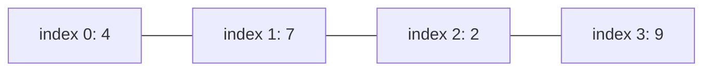
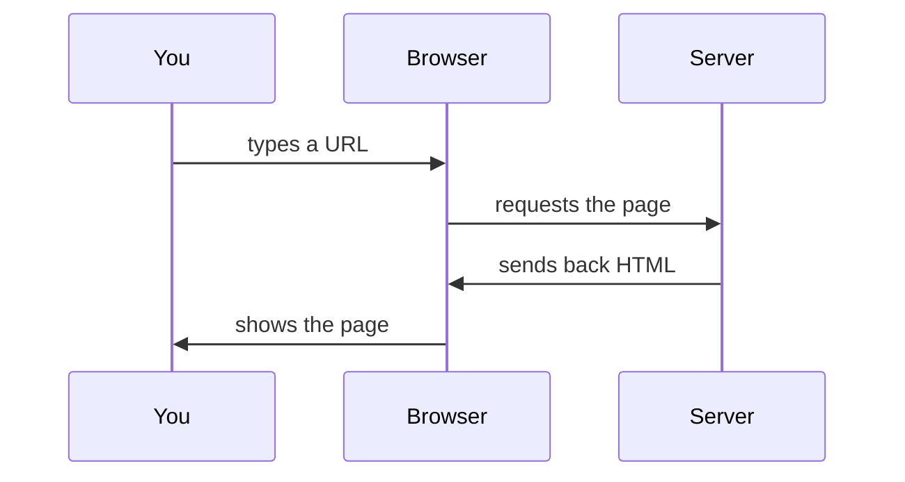

# Statica Learn - Content Generation Spec

This document defines how to write learning paths and lessons for Statica
Learn. It is scoped to content and pedagogy only. Tech stack and data
model live in `statica-learn-tech-spec.md`. UI/visual design is covered
separately. Every file this spec produces must conform to the `Path` and
`Lesson` schemas defined in the tech spec.

---

## 1. Content philosophy

These rules override generic "course writing" instincts. Apply all of
them to every lesson.

There are two primary layers to think about when designing curriculum:
- **Container structure**: how content nests hierarchically (`Path -> Module -> Lesson -> Blocks`).
- **Flow structure**: the order and sequencing in which ideas hit the learner.

Structure alone does not make material engaging—**sequencing** does. The two core drivers that make content **interesting** rather than merely **organized** are:
1. **Concrete before abstract, always.** Never open with a term or syntax. A learner who sees "why" before "what" stays engaged; one who sees "what" first tunes out. Show the problem first, then name the tool that solves it.
2. **Every wrong answer teaches something.** A distractor that is just a random wrong number is wasted space. A distractor that represents an actual misconception (off-by-one, wrong data type) turns even a wrong guess into a lesson.

### Core pedagogical rules

1. **Concrete before abstract.** Never define a concept before the
   learner has seen a situation where it matters. Show the problem, then
   name the tool that solves it. Never open with a definition or a technical term.
2. **No assumed knowledge.** Every technical term used for the first time
   in a path gets a one-sentence plain-language definition inline, the
   moment it appears, not a glossary link.
3. **Answer "why" before "how."** A lesson should never open with
   syntax. It opens with a situation a non-technical person would
   recognize, then shows why the concept exists.
4. **Learning by doing, not reading.** Target ratio per lesson:
   ~20% explanation, ~30% interactive questions, ~30% code/problem
   solving, ~20% reflection or synthesis. If a lesson is mostly text
   blocks, it's wrong.
5. **Every wrong answer teaches something.** Multiple choice distractors
   and failed test cases should correspond to real misconceptions, not
   arbitrary wrong numbers. The explanation for a wrong answer should
   say what the learner probably thought and why it's off.
6. **Small steps, constant feedback.** No block should introduce more
   than one new idea. If a concept needs three ideas, that's three
   blocks.

---

## 2. Container structure (path & module standards)

The container structure defines how content nests:

```text
Path (e.g. "Python")
  └─ Module (e.g. "Working with Lists")
       └─ Lesson (e.g. "Finding Things by Position")
            └─ Blocks (text, question, code, challenge)
```

- **Path length**: aim for 15-25 lessons per path for v1 (matches the
  tech spec's Phase 3 scope of one path built end to end).
- **Module size & scope**: **3-6 lessons per module**. Built around **one skill**,
  not one syntax feature.
  - *"Working with Lists"* is a module.
  - *"The .append() method"* is not—that is a block inside a lesson.
  - If you find yourself needing a module with 10 lessons, **it is actually two modules**. Split it.
- **Lesson length**: 5-12 minutes estimated (`estimatedMinutes`). If a
  topic needs more, split it into two lessons rather than lengthening one.
- **Progression**: each lesson should depend only on concepts introduced
  earlier in the same path. Do not forward-reference.
- **Difficulty labeling**: use `intro` for the first module of a path,
  `easy`/`medium` for the middle, `hard` only for the final 1-2 lessons
  or a path's capstone project.

### Path opening lesson (required)

The first lesson in every path must answer, concretely, "why would
someone want this skill?" using a real scenario before any terminology.
Do not open a path with a definitions lesson.

### Path closing project (required)

The last item in a path should be a `challenge` block or project brief
that combines multiple concepts from the path, not a single-concept
exercise. This is the "prove you can actually do this" moment.

---

## 3. Flow structure (lesson-level sequencing)

This is the part that actually makes lessons easy to understand and
interesting. Structure alone doesn't do that—**sequencing** does: the
precise order in which ideas hit the learner.

Every lesson follows this flow structure, expressed as an ordered `blocks` array:

1. **Hook** (`text`): A real, concrete scenario (2-4 sentences). No definitions yet.
   *"You're building a leaderboard and need 3rd place"* beats *"Lists are ordered collections."*
   Ends by implicitly posing the problem the lesson solves.
2. **One concept** (`text`, optionally with a diagram - see Section 4):
   Introduce **exactly one new idea. Never two.** If it feels like two,
   it's two lessons. Keep to a short paragraph.
3. **Quick check** (`multipleChoice`): A low-stakes multiple choice question
   to confirm the idea landed, not to trick anyone.
4. **Guided practice** (`code`): A small, mostly-working starter snippet
   where the learner predicts the output or fills in one missing gap.
5. **Independent challenge** (`challenge`): Learner writes something real
   from a prompt, validated by `tests`.
6. **Debug or extend** (`challenge`, optional but preferred): Code that almost
   works, and the learner fixes or improves it. This one is underrated but it is
   the **strongest retention driver**, since real engineering work is mostly
   debugging, not writing from scratch. Prioritize including one per lesson
   once the learner has basic fluency with the concept.

Do not include a block type just to hit variety. Every block must serve
the specific concept of that lesson.

---

## 4. Visualization guidance

The current lesson schema has no dedicated diagram block type (see tech
spec, Section 3). Achieve visualization within `text` blocks using
**Mermaid syntax in a fenced code block** - Statica Learn's markdown
renderer should support this (flag to the coding agent building the
renderer: Mermaid support is a dependency of this content spec).

Use a diagram whenever a lesson describes:

- a sequence of steps (flowchart)
- a state that changes over time (before/after states, or a simple state
  diagram)
- a structure with parts and relationships (tree, graph, table layout)
- data moving between components (sequence diagram)

**Do not** use a diagram to illustrate something already obvious from one
sentence of text. A diagram earns its place the same way an image does
elsewhere in this project: it must convey something text alone can't.

### Example: visualizing list indexing



### Example: visualizing a process



### State-tracing tables

For anything involving a variable or data structure changing over
several steps (loops, mutations, recursion), use a markdown table tracing
state line by line rather than prose. This is often clearer than a
diagram and cheaper to write:

| Step | Code executed      | `nums`      | `total` |
| ---- | ------------------ | ----------- | ------- |
| 1    | `total = 0`        | `[4, 7, 2]` | `0`     |
| 2    | `total += nums[0]` | `[4, 7, 2]` | `4`     |
| 3    | `total += nums[1]` | `[4, 7, 2]` | `11`    |

---

## 5. Writing interactive questions

### Multiple choice

- 3-4 options, one correct.
- Every distractor must represent an actual misconception (off-by-one,
  wrong data type, common syntax confusion), never an arbitrary wrong
  number or random choice.
  - A distractor that's just a random wrong number is wasted space.
  - A distractor representing a real misconception turns even an incorrect
    guess into a lesson.
- Write a one-sentence `explanation` for the correct answer that reasons
  from the scenario, not just restates the rule.

### Prediction questions (a `multipleChoice` variant)

Show real code or a real data transformation, then ask what the result
is, before running anything. This is one of the highest-value question
types in the whole platform - use it often, especially early in a
concept's introduction.

### Challenges (independent practice & debugging)

- The `prompt` should describe a small, concrete task, not an abstract
  requirement ("write a function that finds duplicates in a guest list"
  not "implement a deduplication algorithm").
- Include at least 3 `tests`: one typical case, one edge case (empty
  input, single item), one case that would fail a common wrong approach.
- `description` fields on tests should say what the test is checking in
  plain language, since failed-test feedback is a core part of the
  learning loop (see tech spec's execution contract).
- **Debug or extend tasks**: Present code that almost works and ask the
  learner to fix it. Real programming work is mostly debugging rather than
  writing from scratch; this pattern is the single strongest retention driver
  for practical mastery.

---

## 6. Tone and language rules

- Second person, present tense. "You have a list of prices." Not "The
  user has a list of prices."
- Short sentences. One idea per sentence.
- No filler enthusiasm ("Great job!", "Super easy!"). Respect the
  learner's intelligence.
- Never say "just" or "simply" before an instruction, it minimizes real
  difficulty.
- Define a term once per path, in the lesson where it's first used, then
  use it consistently afterward without redefining.

---

## 7. Example lesson (conforms to schema)

````json
{
	"id": "python-lists-indexing",
	"slug": "indexing",
	"title": "Finding Things by Position",
	"description": "How to get a specific item out of a list using its index.",
	"pathId": "python",
	"moduleId": "python-lists",
	"difficulty": "intro",
	"estimatedMinutes": 7,
	"concepts": ["lists", "indexing"],
	"blocks": [
		{
			"type": "text",
			"content": "You're building a leaderboard for a game. You have the top 5 scores stored in order, and you need to show the player in 3rd place. How do you get just that one score out of the list?"
		},
		{
			"type": "text",
			"content": "Every item in a list has a position, called an index. Python starts counting positions at 0, not 1. So the first item is at index 0, the second at index 1, and so on.\n\n```mermaid\ngraph LR\n    A[\"index 0: 512\"] --- B[\"index 1: 488\"] --- C[\"index 2: 470\"] --- D[\"index 3: 455\"]\n```"
		},
		{
			"type": "multipleChoice",
			"question": "scores = [512, 488, 470, 455]\n\nWhich index gets the 3rd place score (470)?",
			"options": ["3", "2", "1", "470"],
			"correctIndex": 1,
			"explanation": "3rd place is the 3rd item, but indexing starts at 0, so it's at index 2, not 3."
		},
		{
			"type": "code",
			"language": "python",
			"starterCode": "scores = [512, 488, 470, 455]\nthird_place = scores[2]\nprint(third_place)"
		},
		{
			"type": "challenge",
			"language": "python",
			"prompt": "You have a list of runners in finish order. Write a function `get_winner(runners)` that returns the name of whoever finished first.",
			"starterCode": "def get_winner(runners):\n    # your code here\n    pass",
			"tests": [
				{
					"input": [["Amy", "Beth", "Cara"]],
					"expectedOutput": "Amy",
					"description": "returns the first name in the list"
				},
				{
					"input": [["Only Runner"]],
					"expectedOutput": "Only Runner",
					"description": "works when there's only one runner"
				}
			]
		}
	]
}
````

---

## 8. Output requirements for the content agent

- One JSON file per lesson, saved to `content/lessons/{pathSlug}/{NN}-{lessonSlug}.json`
  where `NN` is a two-digit order prefix.
- One JSON file per path, saved to `content/paths/{pathSlug}.json`.
- All files must validate against the `Path` and `Lesson` TypeScript
  interfaces in the tech spec. Do not add fields not defined there
  without flagging it.
- Every `concepts` array entry should be a lowercase, hyphenated slug
  (`"variables"`, `"for-loops"`) - these will back the future skill
  tracking system, so keep them consistent across lessons even though
  nothing consumes them yet.
- Generate one path at a time. Do not generate a full multi-path
  catalog in one pass, review quality on the first path before
  replicating the pattern.

---

## 9. Quality checklist (apply to every lesson before finalizing)

- [ ] Module is tightly scoped (3-6 lessons, one cohesive skill, not a single syntax feature)
- [ ] Opens with a concrete scenario ("why" before "what"), not a definition or syntax
- [ ] Introduces exactly one new concept (if two, split into two lessons)
- [ ] Every technical term is defined inline on first use
- [ ] Includes at least one interactive block beyond plain text
- [ ] Quick check confirms understanding without trickery
- [ ] Multiple choice distractors reflect real misconceptions (never arbitrary wrong numbers)
- [ ] Diagram or state-trace included if the concept involves structure, sequence, or change over time
- [ ] Challenge tests include a typical case and an edge case
- [ ] Debug or extend exercise included where appropriate to reinforce retention
- [ ] No block could be deleted without losing something necessary
